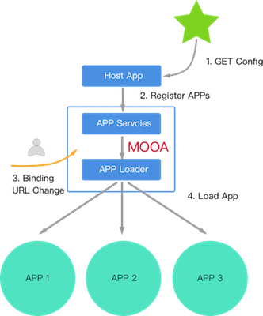

# Mooa

[](https://travis-ci.org/phodal/mooa)
[](https://coveralls.io/github/phodal/mooa?branch=master)
[](https://codeclimate.com/github/phodal/mooa/maintainability)
[](https://www.npmjs.com/package/mooa) 
[](https://www.npmjs.com/mooa)

> A single SPA Utils for Angular 2+

based on [single-spa](https://github.com/CanopyTax/single-spa) && [single-spa-angular-cli](https://github.com/PlaceMe-SAS/single-spa-angular-cli)

difference: 

 - Host <-> Apps Architecture
 - Configurable App (no loader require)
 - Independent App in Different Repo and runnable



Examples: see in [examples/](examples)

Online Demo: 

1. [http://mooa.pho.im/](http://mooa.pho.im/) (host in AWS S3)
2. [http://mooa.phodal.com/](http://mooa.phodal.com/) (host in GitHub Pages)

Features:

1. SPA by Configurable file, ex: ``apps.json``
2. Pluggable APP
3. support Child APP navigate
4. CLI for Generate Config

Goal:

1. 构建插件化的 Web 开发平台，满足业务快速变化及分布式多团队并行开发的需求
2. 构建服务化的中间件，搭建高可用及高复用的前端微服务平台
3. 支持前端的独立交付及部署

Boilerplate
---

App Boilerplate: [https://github.com/phodal/mooa-boilerplate](https://github.com/phodal/mooa-boilerplate)

Usage
---

### 1. Install mooa

in Host and Child App

```sh
yarn add mooa
```

### 2. Config Host

1. add get Apps logic in AppComponent (``app.component.ts``)

```typescript
constructor(private renderer: Renderer2, http: HttpClient, private router: Router) {
  // config Mooa
  this.mooa = new Mooa({
    mode: 'iframe',
    debug: false,
    parentElement: 'app-home',
    urlPrefix: 'app',
    switchMode: 'coexist',
    preload: true,
    includeZone: true
  });
  http.get<IAppOption[]>('/assets/apps.json')
    .subscribe(
      data => {
        this.createApps(data);
      },
      err => console.log(err)
    );
}

private createApps(data: IAppOption[]) {
  data.map((config) => {
    this.mooa.registerApplication(config.name, config, mooaRouter.hashPrefix(config.prefix));
  });

  this.router.events.subscribe((event) => {
    if (event instanceof NavigationEnd) {
      this.mooa.reRouter(event);
    }
  });

  return this.mooa.start();
}
```

### 3. Config App

1. config App ``main.ts`` for load

```typescript
import mooaPlatform from 'mooa';

if (environment.production) {
  enableProdMode();
}

mooaPlatform.mount('help').then((opts) => {
  platformBrowserDynamic().bootstrapModule(AppModule).then((module) => {
    opts['attachUnmount'](module);
  });
});

```

2. setup app routing in ``app.module.ts``

```typescript
const appRoutes: Routes = [
  {path: '*', component: AppComponent}
  ...
];

@NgModule({
  declarations: [
    AppComponent,
    ...
  ],
  imports: [
    BrowserModule,
    RouterModule.forRoot(
      appRoutes
    )
  ],
  providers: [
    {provide: APP_BASE_HREF, useValue: mooaPlatform.appBase()},
  ],
  bootstrap: [AppComponent]
})
export class AppModule {

}
```

3. Add for handle URL Change in ``app.component.ts`` 

```typescript
constructor(private router: Router) {
  mooaPlatform.handleRouterUpdate(this.router, 'app1');
}
```

### 4. Setup apps.json with Mooa CLI

1. install global cli

```bash
npm install -g mooa
```

2. create URL list files

Examples: ``apps.txt``
 
```
http://mooa.phodal.com/assets/app1
http://mooa.phodal.com/assets/help
```

3. Generate Config File

```bash
mooa -g apps.txt
```

Examples:

```json
[
  {
    "name": "app1",
    "selector": "app-app1",
    "baseScriptUrl": "/assets/app1",
    "styles": [
      "styles.bundle.css"
    ],
    "prefix": "app/app1",
    "scripts": [
      "inline.bundle.js",
      "polyfills.bundle.js",
      "main.bundle.js"
    ]
  }
]
```

Mooa Config
---

config in Host app's ``app.component.ts`` 

```typescript
this.mooa = new Mooa({
  mode: 'iframe',
  debug: false,
  parentElement: 'app-home',
  urlPrefix: 'app',
  switchMode: 'coexist'
}) 
```

### mode: 'iframe'

use iframe as application container:

```html
<app-home _nghost-c2="">
  <iframe frameborder="" width="100%" height="100%" src="http://localhost:4200/app/help/homeassets/iframe.html" id="help_206547"></iframe>
</app-home>
```

### switchMode: 'coexist'

hidden application when inactive:

```html
<app-home _nghost-c2="">
  <app-app1 _nghost-c0="" ng-version="5.2.8" style="display: none;"><nav _ngcontent-c0="" class="navbar"></app-app1>
  <iframe frameborder="" width="100%" height="100%" src="http://localhost:4200/app/help/homeassets/iframe.html" id="help_206547"></iframe>
</app-home>
```

For Angular Lazyload Module
---

``inline.bundle.js`` will load script for ``/`` path. 

So, just copy ``*.chunk.js`` files to ``dist/``, then deploy it.


API
---

### registerApplicationByLink

exmples:

```typescript
mooa.registerApplicationByLink('help', '/assets/help', mooaRouter.matchRoute('help'));
```

### registerApplication

```typescript
mooa.registerApplication(config.name, config, mooaRouter.matchRoute(config.prefix));
```

hybrid

```typescript
if (config.sourceType) {
  that.mooa.registerApplicationByLink(config.name, config.link, mooaRouter.matchRoute(config.name));
} else {
  that.mooa.registerApplication(config.name, config, mooaRouter.matchRoute(config.prefix));
}
```

### navigateTo Custom App

```typescript
mooaPlatform.navigateTo({
  appName: 'help',
  router: 'home'
});
```

License
---

[](http://ideas.phodal.com/)

Copyright (c) 2013-2014 Christopher Simpkins
Copyright (c) 2017-2018 Robin Coma Delperier

© 2018 A [Phodal Huang](https://www.phodal.com)'s [Idea](http://github.com/phodal/ideas).  This code is distributed under the MIT license. See `LICENSE` in this directory.
